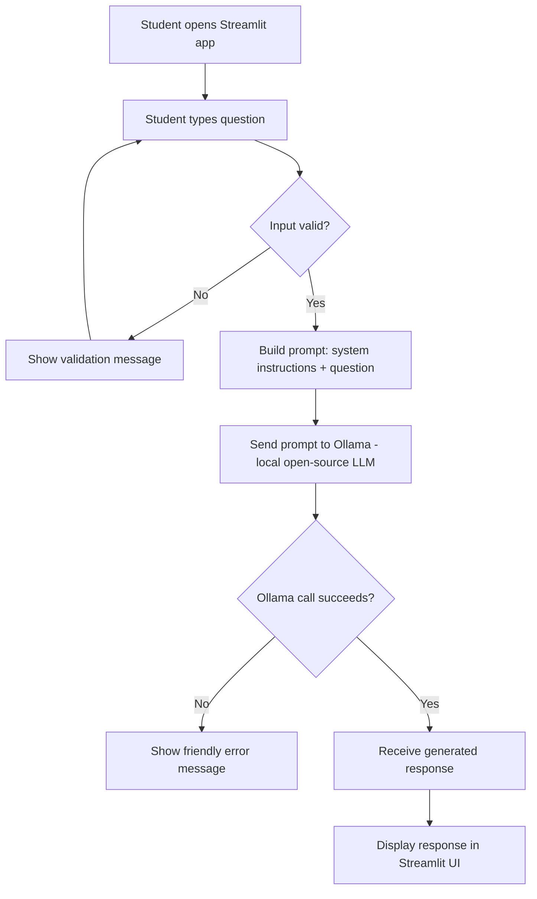

# Study Abroad AI Assistant

An AI-powered Q&A tool that helps prospective international students get quick, plain-language answers to common study-abroad questions — using a local, open-source LLM. No paid APIs, no cloud services, no internet connection required after setup.

> **Course:** CAP 942 — AI Application Development Capstone
> **Author:** [Your Name]

---

## Table of Contents

- [Overview](#overview)
- [Problem It Solves](#problem-it-solves)
- [Intended Users](#intended-users)
- [Features](#features)
- [Tech Stack](#tech-stack)
- [Architecture](#architecture)
- [Application Workflow](#application-workflow)
- [Project Structure](#project-structure)
- [Setup Instructions](#setup-instructions)
- [Running the Application](#running-the-application)
- [Example Usage](#example-usage)
- [Testing](#testing)
- [Limitations & Disclaimer](#limitations--disclaimer)
- [Challenges & Lessons Learned](#challenges--lessons-learned)
- [Possible Next Steps](#possible-next-steps)
- [Submission Checklist](#submission-checklist)

---

## Overview

**Purpose:** Study Abroad AI Assistant lets a student type a free-text question about studying abroad and get an AI-generated answer, powered entirely by a local open-source LLM running through Ollama.

**The problem it solves:** Information about studying abroad — destinations, tuition, scholarships, visas, required documents, work opportunities, application processes — is scattered across dozens of government, university, and third-party websites, often written in dense or inconsistent language. This app gives students one simple place to ask a question and get a clear, conversational answer.

**Intended users:** Prospective international students researching where and how to study abroad, particularly for destinations such as the USA, Canada, UK, and Australia.

---

## Features

- 🎓 Ask any general study-abroad question in plain English
- 🤖 Answers generated by an open-source LLM (via Ollama) — no paid API keys
- 💻 Simple, single-page Streamlit interface
- 🔒 Runs 100% locally — no data leaves your machine
- ⚠️ Basic input validation and error handling (empty input, Ollama not running, model not found)
- 📋 Focused system prompt that keeps the assistant on-topic

**Not included (by design — see [Limitations](#limitations--disclaimer)):** user accounts, persistent chat history across sessions, document retrieval / RAG, multi-language support, deployment to a public server.

---

## Tech Stack

| Component | Choice | Why |
|---|---|---|
| Language | Python 3.11+ | Course-recommended, broad LLM tooling support |
| LLM runner | [Ollama](https://ollama.com) | Simplest way to run open-source models locally on Windows |
| Model | e.g. `llama3.2:3b` or `mistral:7b` | Runs well on CPU with 16 GB RAM; good general Q&A quality |
| LLM client | `ollama` Python package | Official, lightweight client for calling local models |
| UI framework | [Streamlit](https://streamlit.io) | Fast to build, beginner-friendly, well suited to AI demos |
| Dependency management | [`uv`](https://docs.astral.sh/uv/) | Fast, simple `pyproject.toml`-based Python project management |
| Testing | `pytest` | Standard, lightweight Python testing |
| Version control | Git / GitHub | Required for submission |

**Database:** None. This app is intentionally scoped as single-turn Q&A with no retrieval or memory, so no vector or non-vector database is used.

---

## Architecture

The application has four logical components:

1. **UI layer (`app.py`)** — Streamlit widgets that collect the student's question, trigger processing, and display the result. Contains no LLM logic itself.
2. **Prompt layer (`prompts.py`)** — Holds the system prompt and a function that combines it with the student's question into the final prompt sent to the model.
3. **LLM service layer (`llm_helper.py`)** — Wraps the call to Ollama, sends the prompt, and returns clean response text (or raises a clear error).
4. **Validation / error handling** — Checks that input isn't empty before any LLM call is made, and catches exceptions around the Ollama call (e.g. service not running, model missing) so failures never crash the app.

**Data flow:** UI layer → input validation → prompt layer → LLM service layer → back to UI layer for display.

**Knowledge source:** This app does not use retrieval-augmented generation (RAG) or any database. Every answer comes solely from what the open-source model already learned during its training — nothing is looked up live. See [Limitations](#limitations--disclaimer) for what this means in practice.

---

## Application Workflow



The open-source LLM is invoked exactly once per question, at step **F** — this is the only point where model inference happens.

---

## Project Structure

```
study-abroad-ai-assistant/
├── app.py                    # Streamlit UI — entry point (`streamlit run app.py`)
├── llm_helper.py              # Wraps calls to Ollama
├── prompts.py                  # System prompt + prompt-building function
├── utils.py                    # Input-validation helpers
├── pyproject.toml              # uv-managed project + dependencies
├── README.md                    # This file
├── docs/
│   └── workflow_diagram.png    # Exported workflow diagram (optional, Mermaid source above)
└── tests/
    └── test_prompts.py         # Unit tests for the prompt-building function
```

---

## Setup Instructions

### Prerequisites

- Windows 10/11 (or macOS/Linux)
- Python 3.11 or later
- [`uv`](https://docs.astral.sh/uv/getting-started/installation/) installed
- [Ollama](https://ollama.com/download) installed
- At least 16 GB RAM recommended for a 3B–7B model

### 1. Clone the repository

```bash
git clone https://github.com/<your-username>/study-abroad-ai-assistant.git
cd study-abroad-ai-assistant
```

### 2. Install and start Ollama

Download and install Ollama from [ollama.com/download](https://ollama.com/download), then pull a model:

```bash
ollama pull llama3.2:3b
```

Ollama runs as a background service after installation — no need to start it manually on most systems. Verify it's running:

```bash
ollama list
```

### 3. Install Python dependencies with uv

```bash
uv sync
```

This creates a virtual environment and installs everything listed in `pyproject.toml`.

---

## Running the Application

```bash
uv run streamlit run app.py
```

This opens the app in your default browser at `http://localhost:8501`. Type a study-abroad question into the text box and click **Ask**.

---

## Example Usage

| Input | Example Output |
|---|---|
| "What documents do I typically need for a UK student visa?" | A general list such as a valid passport, Confirmation of Acceptance for Studies (CAS), proof of funds, and English proficiency test results — with a note to confirm exact requirements with the UK government's official visa page. |
| "How does the university application process usually work in Canada?" | An overview of typical steps: researching programs, meeting language/academic requirements, submitting applications and transcripts, and applying for a study permit after acceptance. |
| "What scholarships are available for studying in Australia?" | A general overview of common scholarship categories (government-funded, university-funded, external), with a recommendation to check official university and government scholarship portals for current listings. |
| (empty input) | "Please enter a question before clicking Ask." |
| (Ollama service not running) | "Sorry, I couldn't reach the AI model right now. Please make sure Ollama is running and try again." |

*(Screenshots of the running app should be added here before submission.)*

---

## Testing

**Component tests:** `pytest` tests cover the prompt-building function (`build_prompt`) and input validation (`is_valid_question`). Run them with:

```bash
uv run pytest
```

**Manual end-to-end test cases:**

1. Ask a general, on-topic question (e.g. about visas) → expect a relevant, plain-language answer.
2. Ask a general cost/scholarship question → expect an answer that avoids presenting made-up exact figures as guaranteed facts.
3. Submit empty input → expect a validation message, no LLM call made.
4. Ask an off-topic question (e.g. "write me a poem") → expect the assistant to decline or redirect.
5. Stop the Ollama service, then ask a question → expect a friendly error message, not a crash.

**Evaluating answer quality:** For each test question, check (a) is it on-topic, (b) does it avoid overconfident specific claims (fees, deadlines) it can't verify, and (c) is it readable in under 30 seconds.

---

## Limitations & Disclaimer

⚠️ **This app is for general guidance only. It is not a substitute for official immigration, university, or government advice.**

- **No retrieval or database is used.** This app does not perform document search or retrieval-augmented generation (RAG). Every answer comes solely from the open-source model's training data — nothing is looked up live from the internet or any document store.
- Because of this, the model may be **outdated, generic, or simply wrong** on time-sensitive or highly specific facts, such as exact visa fees, current application deadlines, or this year's tuition figures.
- The app does **not** guarantee visa approval, admission outcomes, or exact costs, and should not be treated as legal or immigration advice.
- No personal data is collected, stored, or transmitted — all processing happens locally on your machine, and no conversation history is saved between sessions.
- Always verify specific, actionable information (fees, deadlines, requirements) with the relevant official embassy, government, or university source.

---

## Challenges & Lessons Learned

*(Fill in during/after development — examples of what to cover:)*

- Getting Ollama configured and confirming which model size ran acceptably on available hardware
- Tuning the system prompt to keep answers on-topic without being overly restrictive
- Balancing helpful answers against the risk of the model inventing overly specific facts with no retrieval to ground it
- Handling the Streamlit rerun model so the LLM wasn't called on every UI interaction, only on button click

---

## Possible Next Steps

- Add a country-selection dropdown that gets inserted into the prompt for more targeted answers
- Add in-session conversation memory using `st.session_state` (without persisting across sessions)
- Introduce a small retrieval layer (RAG) over a curated FAQ document for more grounded, current answers
- Add simple caching for repeated questions

---

## Submission Checklist

- [ ] Repository follows `FirstName_LastName_CapstoneAI` naming convention
- [ ] This README complete with all sections above and real screenshots
- [ ] `pyproject.toml` includes all dependencies, no paid API keys required
- [ ] Workflow diagram matches the actual implementation
- [ ] Tests included and passing (`uv run pytest`)
- [ ] `.gitignore` excludes virtual environments and cache files
- [ ] No secrets or API keys committed to the repository
