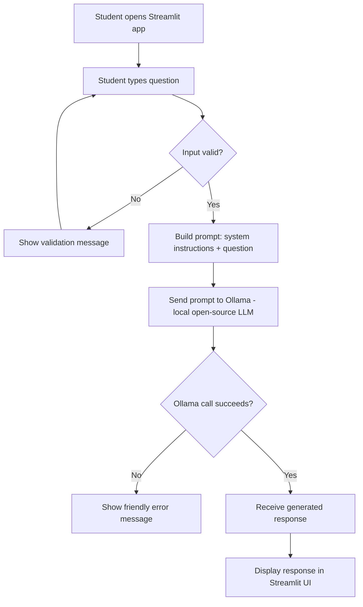

# Study Abroad AI Assistant — Implementation Plan

## 1. Project Title

**Study Abroad AI Assistant** — an LLM-powered Q&A tool for prospective international students.

## 2. Project Summary

Study Abroad AI Assistant is a Streamlit web application that lets students type a question about studying abroad — destinations, tuition, scholarships, visas, required documents, work opportunities, or application processes — and receive an answer generated by an open-source LLM running locally through Ollama. The app takes plain-language questions and turns them into grounded, easy-to-read guidance without requiring the student to dig through scattered websites.

**Value proposition:** Get clear, conversational answers to common study-abroad questions in seconds, without paid APIs or manual research.

## 3. Problem Statement

**Problem:** Information about studying abroad (costs, visas, scholarships, application steps) is scattered across many government, university, and third-party sites, and is often written in dense, inconsistent language.

**Why it matters:** Prospective students — especially first-generation applicants — waste time and can miss deadlines or requirements simply because the information is hard to find or interpret.

**Intended users:** Students (like the persona this project is built around) researching where and how to study abroad, particularly in countries such as the USA, Canada, UK, and Australia.

## 4. Capstone Requirement Alignment

| Capstone Requirement | How the Application Meets It | Evidence / Deliverable |
|---|---|---|
| Use one open-source LLM | App calls a local model (e.g. Llama 3 or Mistral) via Ollama | `llm_helper.py` module, code walkthrough in presentation |
| Accept user input | Streamlit text input/text area for the student's question | `app.py` UI, live demo |
| Produce LLM-generated output | Model response displayed back in the UI | Live demo, screenshots in README |
| Run as a small web app (Streamlit) | Entire app built and run with `streamlit run app.py` | Working app, GitHub repo |
| Database only if retrieval/memory is used | Not used — app is intentionally single-turn Q&A with no persistence | Scope section of README explains this decision |
| Workflow diagram | Mermaid diagram (Section 7) reproduced in final documentation | `docs/workflow_diagram.png` or embedded Mermaid in README |
| Documentation & presentation | README, architecture description, challenges/lessons | README.md, presentation slides |
| No paid APIs | Ollama runs a local open-source model; no external API keys | `requirements.txt` / `pyproject.toml`, code review |

## 5. Project Scope

**MVP features (required):**
- Single text input where the student types one question
- "Ask" button that sends the question to the local LLM through Ollama
- Displayed AI-generated answer
- A system prompt that keeps answers focused on study-abroad topics
- Basic error handling (empty input, Ollama not running, model not found)
- README with setup and run instructions
- Mermaid workflow diagram

**Out of scope for this project (do not build):**
- User accounts / login
- Persistent chat history across sessions
- Vector database or document retrieval (RAG)
- Multi-language support
- Deployment to a public cloud server

**Optional enhancements (only after MVP is fully working and tested):**
- In-session conversation memory (remember the last few Q&A turns within one Streamlit session using `st.session_state`)
- A dropdown to pick a destination country, which is inserted into the prompt
- Simple response caching for repeated questions
- Light RAG over a small curated FAQ file (only if time allows — this crosses into "Advanced" territory, so treat it as a stretch goal, not a requirement)

## 6. Recommended Technology Stack

| Component | Choice | Why |
|---|---|---|
| Open-source LLM | Llama 3 (8B) via Ollama, or Mistral 7B | Both run well on CPU-only Windows machines with 16 GB RAM; good general Q&A quality |
| Model runner | Ollama | Simplest local LLM runner on Windows; one command to pull and serve a model |
| Python libraries | `ollama` (official Python client), `python-dotenv` (optional, for config) | Minimal, beginner-friendly; avoids the extra complexity of LangChain for a single-turn app |
| Application framework | Streamlit | Fastest way to build a usable UI as a beginner; matches your chosen format |
| Database | None | MVP has no retrieval or memory requirement, so a database would add complexity without benefit |
| Dependency management | `uv` | Fast, simple `pyproject.toml`-based workflow, works well on Windows |
| Dev tools | VS Code, Git, GitHub Desktop or Git CLI | Standard, beginner-friendly toolchain |

**Hardware considerations:** You're on Windows — confirm your RAM before picking a model size:
- 16 GB RAM: use a **3B–7B** model (e.g. `llama3.2:3b` or `mistral:7b`) for comfortable performance.
- If responses are too slow or your machine struggles, fall back to a smaller model like `llama3.2:1b` or `phi3:mini`.

**TODO for you:** Run `ollama list` after installing Ollama and note how much RAM your machine actually has (Task Manager → Performance tab) so you can confirm which model size fits.

## 7. Application Workflow

**Flow:** The student opens the Streamlit app in a browser, types a question into a text box, and clicks "Ask." Python takes that raw text, inserts it into a prompt template (which includes a system instruction to stay on-topic), and sends the combined prompt to the local LLM through the Ollama Python client. Ollama runs the model and returns generated text, which Python then displays back in the Streamlit UI. If anything fails (empty input, Ollama not reachable, model missing), the app shows a friendly error instead of crashing.



The **open-source LLM** is used exactly once per question, inside the Ollama call in step F — this is the only place model inference happens.

## 8. Application Architecture

**Major components:**

1. **UI layer (`app.py`)** — Streamlit widgets for input, button, and output display. Responsibility: collect user input, trigger processing, render results. No LLM logic lives here.
2. **Prompt layer (`prompts.py`)** — Holds the system prompt and a function that combines it with the user's question into a final prompt string. Responsibility: keep prompt text separate from application logic so it's easy to iterate on.
3. **LLM service layer (`llm_helper.py`)** — Wraps the Ollama client call. Responsibility: send the prompt, receive the raw response, and return clean text (or raise a clear exception).
4. **Validation/error-handling layer** — Small functions (can live in `app.py` or a `utils.py`) that check input isn't empty and catch exceptions from the LLM layer.

**Information flow:** UI layer → validation → prompt layer → LLM service layer → back to UI layer for display.

**Where errors are handled:** At two points — (a) input validation before any LLM call is made, and (b) around the Ollama call itself (connection errors, missing model, timeouts), so a failure never crashes the whole app.

## 9. Proposed Project Structure

```
study-abroad-ai-assistant/
├── app.py                 # Streamlit UI — entry point you run with `streamlit run app.py`
├── llm_helper.py           # Wraps calls to Ollama; you will write this
├── prompts.py               # System prompt + prompt-building function; you will write this
├── utils.py                 # Small input-validation helpers (optional, your choice)
├── pyproject.toml           # uv-managed project + dependency definitions
├── README.md                 # Setup, usage, screenshots, workflow diagram
├── docs/
│   └── workflow_diagram.png # Exported version of the Mermaid diagram (optional)
└── tests/
    └── test_prompts.py      # Simple tests for your prompt-building function
```

I'm intentionally **not** writing the contents of `app.py`, `llm_helper.py`, or `prompts.py` for you — those are yours to build using the guided examples and milestones below.

## 10. Step-by-Step Development Milestones

### Milestone 1 — Get Ollama running and talk to it from Python
- **Learning objective:** Understand how a local LLM is served and called.
- **Concepts to review:** What a local model server is; what `pip`/`uv` dependencies do; basic Python function calls.
- **Development tasks:** Install Ollama, pull a small model (`ollama pull llama3.2:3b`), install the `ollama` Python package, write a throwaway script that sends one hard-coded question and prints the response.
- **Coding exercise:** Change the hard-coded question three times and observe how responses differ.
- **Testing checkpoint:** Your script prints a real, coherent answer with no errors.
- **Acceptance criteria:** You can call the model from Python and get text back, reliably, at least 3 times in a row.
- **Common mistakes:** Forgetting to start the Ollama service; using a model name that isn't pulled yet; not handling the case where the response is empty.
- **What you need to build yourself:** The exact function signature and how you structure the call (e.g. what you name variables, whether you use streaming or not).
- **How you'll know it works:** You get a printed, sensible answer to a study-abroad-style question with no exceptions.

### Milestone 2 — Build the prompt layer
- **Learning objective:** Learn why separating "what to ask" from "how to ask it" matters, and practice basic prompt engineering.
- **Concepts to review:** String formatting/f-strings; the idea of a "system prompt" vs. a "user prompt."
- **Development tasks:** Write a system prompt that scopes the assistant to study-abroad topics; write a function that takes the user's question and returns the combined prompt string.
- **Coding exercise:** Test your function with 3 different questions and print the combined prompt to check it reads correctly.
- **Testing checkpoint:** The combined prompt clearly contains both your system instructions and the user's exact question.
- **Acceptance criteria:** Passing an empty string or a very long question doesn't crash the function.
- **Common mistakes:** System prompt too vague (model wanders off-topic) or too restrictive (model refuses reasonable questions).
- **What you need to build yourself:** The actual wording of your system prompt and how strict vs. flexible you make it.
- **How you'll know it works:** Off-topic questions ("write me a poem") get redirected or declined; on-topic questions get answered.

### Milestone 3 — Wrap it in a Streamlit UI
- **Learning objective:** Learn how Streamlit's script-rerun model works and how to wire a button to a function call.
- **Concepts to review:** `st.text_input`/`st.text_area`, `st.button`, `st.write`, how Streamlit reruns your whole script on interaction.
- **Development tasks:** Create `app.py`, add an input box and "Ask" button, call your Milestone 1–2 functions when clicked, display the result.
- **Coding exercise:** Add a `st.spinner("Thinking...")` around the LLM call so the user sees feedback while waiting.
- **Testing checkpoint:** Run `streamlit run app.py`, type a real question, click Ask, see a real answer appear.
- **Acceptance criteria:** The full loop (type → click → see answer) works at least 5 times without restarting the app.
- **Common mistakes:** Calling the LLM on every script rerun instead of only on button click; not disabling the button while waiting.
- **What you need to build yourself:** The actual layout and wording of your UI (labels, placeholder text, headings).
- **How you'll know it works:** A non-technical person could use the app without your help.

### Milestone 4 — Add validation and error handling
- **Learning objective:** Learn defensive coding — anticipating and handling failure paths.
- **Concepts to review:** `try`/`except` in Python; what exceptions the `ollama` client can raise.
- **Development tasks:** Reject empty/whitespace-only input with a clear message; wrap the LLM call in `try`/`except` and show a friendly message if Ollama isn't running or the model is missing.
- **Coding exercise:** Deliberately stop the Ollama service and confirm your app shows a clean error instead of a stack trace.
- **Testing checkpoint:** Submitting empty input, and submitting input while Ollama is stopped, both produce readable messages, not crashes.
- **Acceptance criteria:** No unhandled exception ever reaches the Streamlit UI as a raw traceback.
- **Common mistakes:** Catching `Exception` too broadly and hiding real bugs; forgetting to test the "Ollama not running" case.
- **What you need to build yourself:** The exact validation rules and error message wording.
- **How you'll know it works:** You can't make the app crash no matter what you type or how you break the Ollama connection.

### Milestone 5 — Polish, test, and document
- **Learning objective:** Practice testing and writing documentation someone else could follow.
- **Concepts to review:** Basic `pytest` usage; what makes a good README.
- **Development tasks:** Write a couple of tests for your prompt-building function; write the README (setup, run instructions, example Q&A, screenshots); export your Mermaid diagram.
- **Coding exercise:** Write one test that checks your prompt function includes the user's exact question in the output.
- **Testing checkpoint:** `pytest` runs and passes; a friend (or you, on a fresh clone) can follow the README from scratch to a running app.
- **Acceptance criteria:** README covers setup, run command, and at least 2 example questions with real outputs.
- **Common mistakes:** README assumes steps that only you know (e.g. "obviously start Ollama first").
- **What you need to build yourself:** The README content and your own example Q&A pairs, run on your machine.
- **How you'll know it works:** Someone unfamiliar with the project could get it running using only the README.

## 11. Guided Code Examples

These are isolated snippets to teach single concepts. None of them form a working app on their own — you must adapt and connect them yourself.

**Example A — Validating user input**
```python
def is_valid_question(text: str) -> bool:
    """Return True only if the question has real content."""
    # .strip() removes leading/trailing whitespace so " " doesn't pass as valid
    cleaned = text.strip()
    return len(cleaned) > 0  # TODO: consider also rejecting overly long input

# Practice: call is_valid_question("") and is_valid_question("  ") and confirm both return False
```

**Example B — Calling Ollama (single concept: the API call itself)**
```python
import ollama

def ask_model(prompt: str, model_name: str) -> str:
    # ollama.chat sends the prompt and blocks until a response is ready
    response = ollama.chat(
        model=model_name,
        messages=[{"role": "user", "content": prompt}],
    )
    # TODO: extract just the text content from `response` and return it
    return response  # placeholder — this returns the full object, not just text
```

**Example C — Building a reusable prompt function**
```python
SYSTEM_PROMPT = "You are a helpful study-abroad advisor..."  # TODO: write your full system prompt

def build_prompt(user_question: str) -> str:
    # Combining system instructions with the user's question in one string
    return f"{SYSTEM_PROMPT}\n\nStudent question: {user_question}"
    # TODO: decide if you want to add extra structure, like requesting a specific format

# Practice: print build_prompt("What visa do I need for the UK?") and inspect the output
```

**Example D — Handling one common error**
```python
def safe_ask(prompt: str, model_name: str) -> str:
    try:
        # TODO: call your ask_model() function from Example B here
        result = None
        return result
    except Exception as e:
        # Beginner note: printing the real error helps you debug locally
        print(f"LLM call failed: {e}")
        return "Sorry, I couldn't reach the AI model right now. Please try again."
```

**Example E — Processing the model response**
```python
def clean_response(raw_text: str) -> str:
    # Strip extra whitespace the model sometimes adds
    text = raw_text.strip()
    # TODO: decide if you want to truncate very long responses, or leave as-is
    return text
```

## 12. Prompt-Engineering Plan

- **Purpose of the system prompt:** Keep the assistant focused on study-abroad topics (destinations, costs, visas, scholarships, applications) and set a helpful, plain-language tone.
- **Information the user provides:** A free-text question.
- **Expected response format:** A short, plain-language paragraph (2–5 sentences), avoiding legal/financial guarantees.
- **Example prompt template:**
```
System: You are a study-abroad advisor for prospective international students.
Answer only questions related to studying abroad: destinations, tuition, scholarships,
visas, required documents, work opportunities, and application processes.
If the question is unrelated, politely say so and redirect.
Keep answers concise, plain-language, and avoid making specific legal guarantees.

Student question: {user_question}
```
- **Reducing unclear/unsupported answers:** Instruct the model to say "I'm not certain — please check official embassy/university sources" when it lacks confidence, rather than guessing; keep questions scoped narrowly rather than open-ended.
- **Where the model's knowledge comes from (no RAG in this app):** Since there is no vector database or document retrieval, every answer comes only from what the LLM learned during training — nothing is looked up live. This means:
  - Avoid framing the app around hyper-specific, time-sensitive facts (exact visa fees, this year's deadlines, current tuition numbers) — that's where an ungrounded model is most likely to hallucinate.
  - Favor general/process-level questions ("what documents are typically needed for a UK student visa") over precise numeric ones.
  - **Optional technique — in-context grounding:** you may paste a short, fixed block of factual text (a few sentences you write yourself, not a database) directly into the system prompt for extra context. This is different from RAG — nothing is searched, the same fixed text is included in every prompt. Useful if you want slightly steadier answers without building retrieval.
  - **TODO for you:** decide, and document in your README, whether you're relying purely on the model's trained knowledge or adding a small in-context fact block — either is a legitimate MVP choice, but the grader should see you made it deliberately.

## 13. Testing Plan

**Component tests:** Test `build_prompt()` and `is_valid_question()` directly with `pytest`.

**End-to-end test:** Run the full app manually and walk through the flow from typing a question to seeing an answer.

**Five realistic test cases:**
1. "What documents do I need for a UK student visa?" → Expect a relevant, on-topic answer mentioning visa/documents.
2. "How much does it cost to study in Canada?" → Expect an answer discussing tuition/cost ranges, without inventing exact dollar figures as guarantees.
3. "" (empty input) → Expect a validation message, no LLM call made.
4. "Write me a poem about cats" (off-topic) → Expect the assistant to decline/redirect per the system prompt.
5. Ollama service stopped, then ask any question → Expect a friendly error message, not a crash.

**Evaluating LLM output quality (simple method):** For each test question, manually check: (a) Is it on-topic? (b) Does it avoid inventing specific numbers/guarantees it can't verify? (c) Is it readable in under 30 seconds? Keep a small table of question → pass/fail in your README or test notes.

## 14. Privacy, Security, Accessibility, and Responsible-AI Considerations

- **Risks:** The model can hallucinate specific facts (visa fees, deadlines, scholarship amounts) that are wrong or outdated.
- **Limitations:** This app is not a substitute for official embassy, government, or university guidance. Because the app has no retrieval/database layer, answers rely entirely on the model's training data — they are not looked up from current sources, so they can be outdated or generic, especially for exact fees or deadlines.
- **Mitigations:** System prompt discourages overconfident, specific claims; UI includes a visible disclaimer ("For general guidance only — verify with official sources"); no personal data is stored or transmitted (single-turn, local-only processing).
- **Accessibility:** Use clear labels on Streamlit widgets and readable font sizes (Streamlit defaults are reasonable; avoid color-only cues).
- **Claims the app should not make:** It should never claim to guarantee visa approval, exact costs, or admission outcomes, and should not present itself as legal or immigration advice.

## 15. Documentation and GitHub Plan

**README sections:** Project overview, problem statement, features, tech stack, setup instructions, how to run, example inputs/outputs with screenshots, workflow diagram, limitations/disclaimer (including that answers come from the model's trained knowledge, not live lookup — no retrieval/database is used), challenges & lessons learned.

**Setup instructions to include:** Installing Ollama, pulling the chosen model, installing Python deps with `uv`, running `streamlit run app.py`.

**Dependency documentation:** List packages and versions in `pyproject.toml`; briefly explain what each one does in the README.

**GitHub submission checklist:**
- [ ] Repo named per the `FirstName_LastName_CapstoneAI` convention (or matching folder inside it)
- [ ] `README.md` complete with all sections above
- [ ] `pyproject.toml` with all dependencies pinned
- [ ] No API keys or secrets committed
- [ ] Workflow diagram included (Mermaid source and/or exported image)
- [ ] Tests included and passing
- [ ] `.gitignore` excludes virtual environments and cache files

## 16. Presentation Plan

**Suggested structure (5–10 minutes):**
1. Problem & motivation (1 min)
2. Live demo: ask 2–3 real questions (3 min)
3. Workflow diagram walkthrough (2 min)
4. Tools/architecture summary (1–2 min)
5. Challenges, lessons learned, and next steps (1–2 min)

**Live demo sequence:** Start Ollama → launch Streamlit app → ask an on-topic question → ask an off-topic question to show the guardrail → (optionally) show the empty-input and error-handling behavior.

**Possible next steps to mention:** Country-specific dropdown, session memory, or a small RAG layer over an FAQ document.

## 17. Suggested Timeline

| Session | Focus |
|---|---|
| 1 | Install Ollama, pull model, complete Milestone 1 |
| 2 | Complete Milestone 2 (prompt layer) |
| 3 | Complete Milestone 3 (Streamlit UI) — MVP loop working |
| 4 | Complete Milestone 4 (validation & error handling) |
| 5 | Testing, README, workflow diagram (Milestone 5) |
| 6 | Buffer / optional enhancements (only if MVP is fully done and tested) |
| 7 | Presentation prep and rehearsal |

## 18. Definition of Done

- [ ] App accepts a typed question and displays an LLM-generated answer end-to-end
- [ ] Uses one open-source LLM via Ollama, no paid APIs
- [ ] Runs as a working Streamlit app via `streamlit run app.py`
- [ ] Input validation and LLM-call error handling both implemented and tested
- [ ] System prompt keeps responses on-topic and non-overconfident
- [ ] At least 5 test cases documented with expected behavior
- [ ] README complete with setup, run instructions, example Q&A, and disclaimer
- [ ] Workflow diagram included and matches actual implementation
- [ ] Code is readable, commented, and organized per the proposed project structure
- [ ] Presentation prepared covering problem, demo, workflow, tools, and lessons learned
- [ ] Repository follows submission naming convention and is ready for GitHub/Canvas submission
